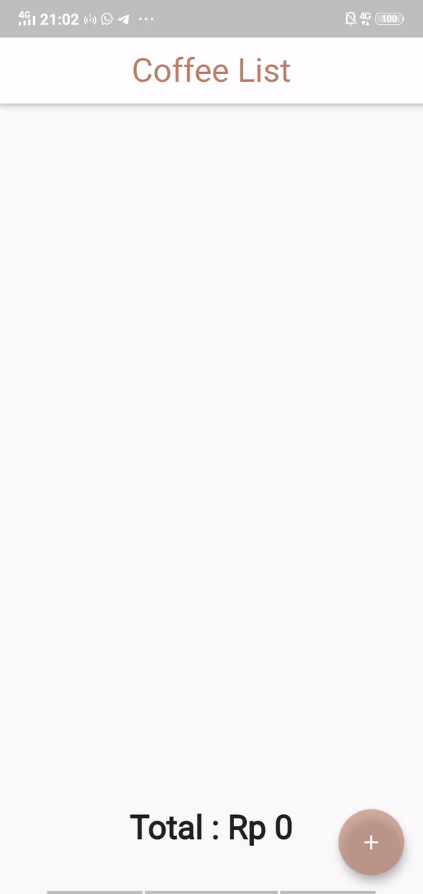
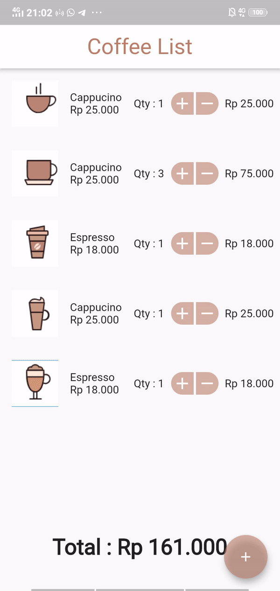

# Coffee List Provider

Coffee shop cart list with total price using provider state management. 

## Features

### Provider State Management
- Simple but robust State Management Method, implemented in total price calculation

### One Touch Experience 
- Easily add cart with only one touch.

### Easy Remove
- auto remove item when quantity equal to zero

### Simple Home Screen
- Simple and neat home screen UI

## Sources
- [Coffee List UI Design](https://www.sketchappsources.com/free-source/3438-coffee-app-sketch-freebie-resource.html) : Original UI design by Eman Tawfik.

## License
This project is licensed under the MIT license, Copyright (c) 2020 Muhammad Hanifan Muslim H For more information see LICENSE.md.
